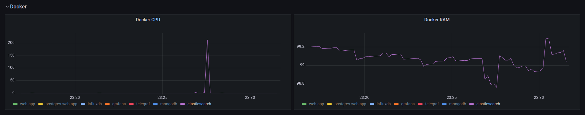
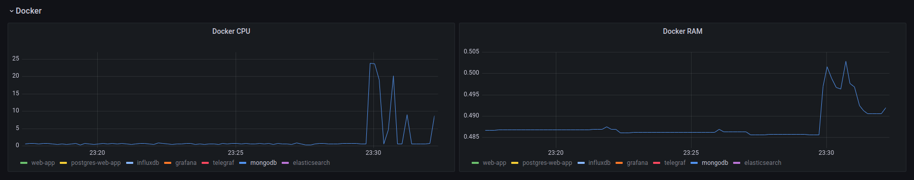
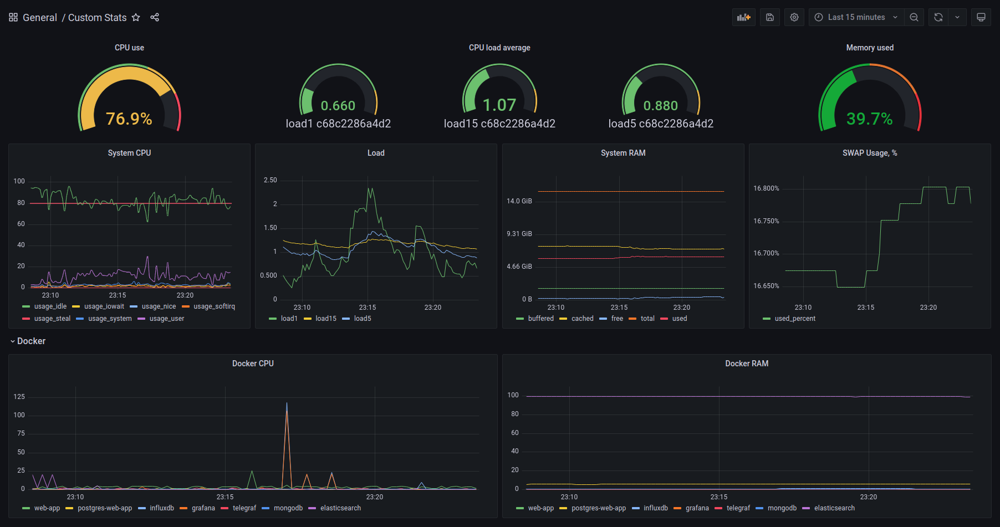

# TIG stack for monitoring

Example of usage telegraf, influxdb and grafana for monitoring of different system resources.
Project consist of:
 - [Django](https://www.djangoproject.com/) (simple web app) 
 - [PostgreSQL](https://www.postgresql.org/)
 - [MongoDB](https://www.mongodb.com/)
 - [Elasticsearch](https://www.elastic.co/)
 - [Telegraf](https://www.influxdata.com/time-series-platform/telegraf/)
 - [InfluxDB](https://www.influxdata.com/)
 - [Grafana](https://grafana.com/)

### Requirements:
 - [Python](https://www.python.org/) >3.8
 - [Docker](https://docs.docker.com/get-docker/) >20.10.7
 - [Docker Compose](https://docs.docker.com/compose/install/) >2.1.0

### Setup

Firstly, need to clone the git repository. Then, to allow telegraf get metrics from docker, need to give telegraf user in docker compose file access to docker socket. Run next command to get docker group ID
```shell
stat -c '%g' /var/run/docker.sock
```
Then create `.env` file with obtained number for variable `GID`:
```
GID:XXX
```

To run all services, execute `run.sh` file:
```shell
sudo sh run.sh
```

After start of all containers, need to create and activate virtual environment, then install python libraries from requirements.txt with next command (inside activated environment):
```shell
pip install -r web-app/requirements.txt 
```
And run setup script, which create datasource & dashboard for grafana and create index for elasticsearch:
```shell
python3 setup.py
```

Enjoy nice resource monitoring dashboard on http://127.0.0.1:3000/dashboards -> **Custom stats** dashboard (login: admin, pass: admin)

### Testing

To creat load on our services, [ab](https://httpd.apache.org/docs/2.4/programs/ab.html) can be used - Apache HTTP server benchmarking tool.

#### ab installation on Ubuntu:
```shell
sudo apt-get update
sudo apt-get install apache2-utils
```

#### ab installation on ArchLinux:
```shell
sudo pacman -Sy
sudo pacman -S apache
```

Command to creat load (create documents in elasticsearch through our web app):
```shell
ab -p "test.json" -n 500 -c 100 http://127.0.0.1:8000/api/test_app/elastic/
```
Result can be seen on dashboard: 


Command to creat load (insert entries in mongodb through our web app):
```shell
ab -p "test.json" -n 500 -c 100 http://127.0.0.1:8000/api/test_app/entries/random/
```
Result can be seen on dashboard: 



