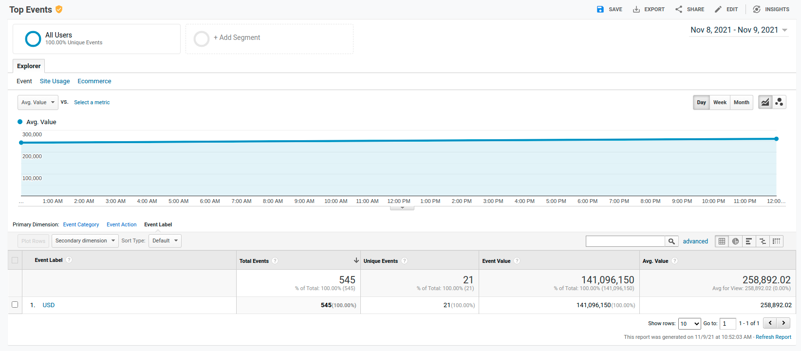

# Projector | homework 3 
## Google Analytics Measurement Protocol 

- Created using pygamp python lib
- Get currency ratio via NBU API
- Multiple currency rate by 10000 because event`s value should be INT
- Deployed to Heroku
- scheduler: using apscheduler lib

### Events appear in GA console in the real time

### One day report
