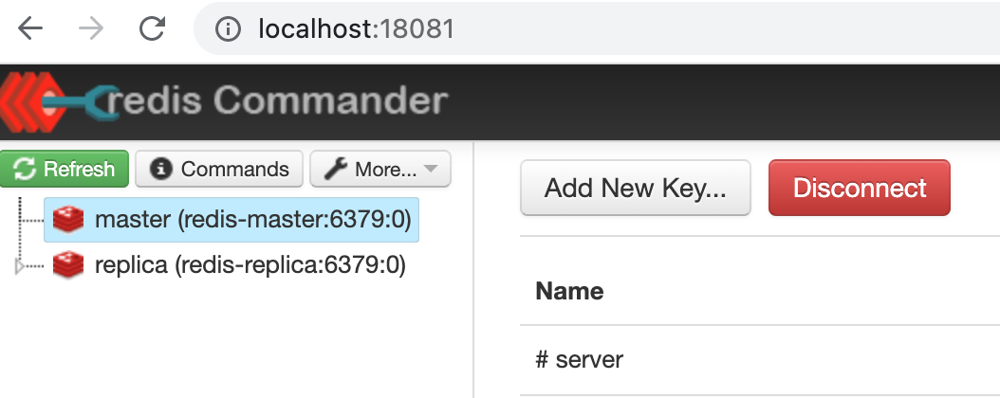
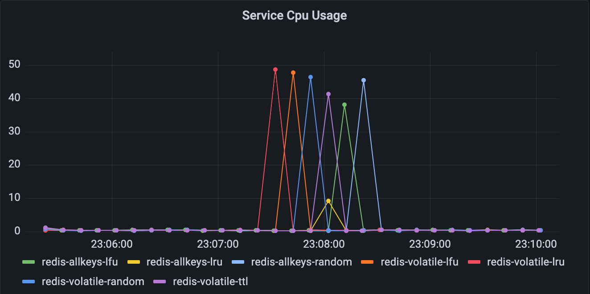
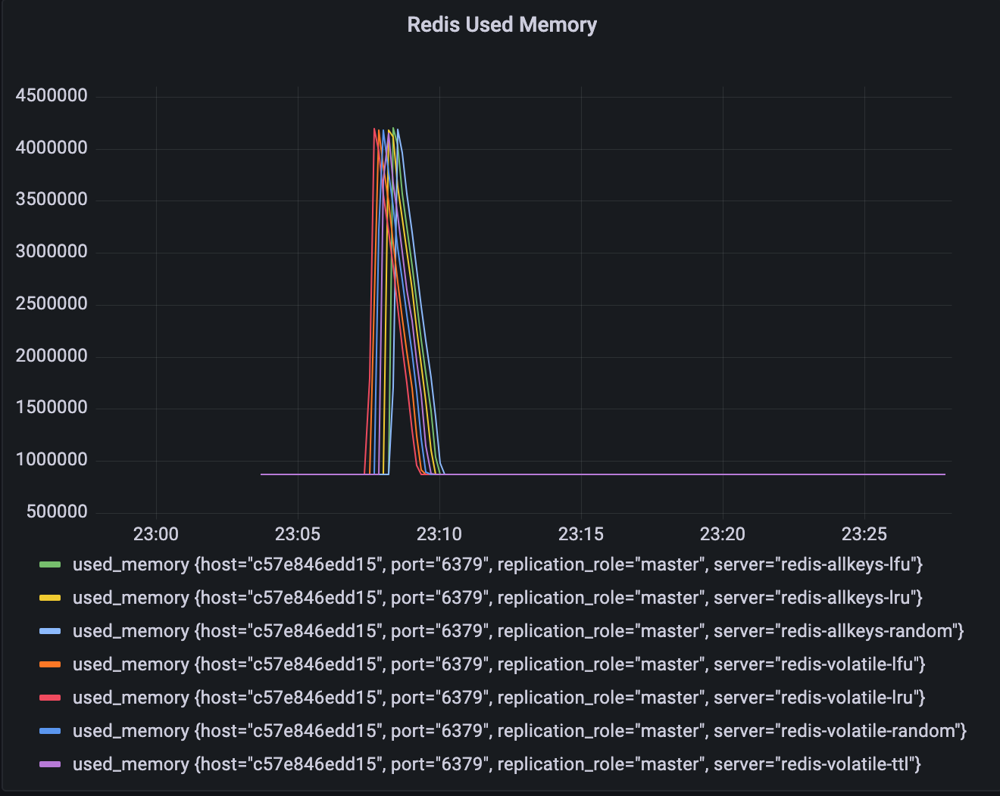
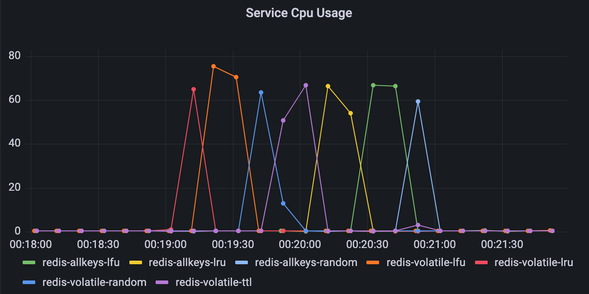
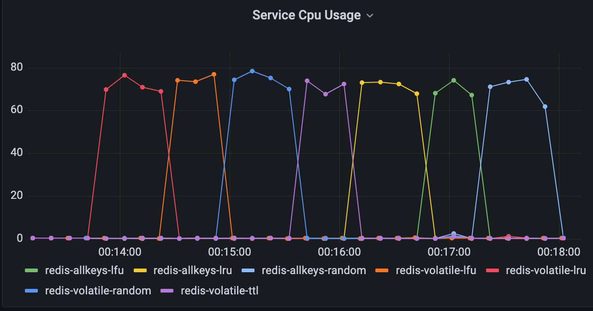
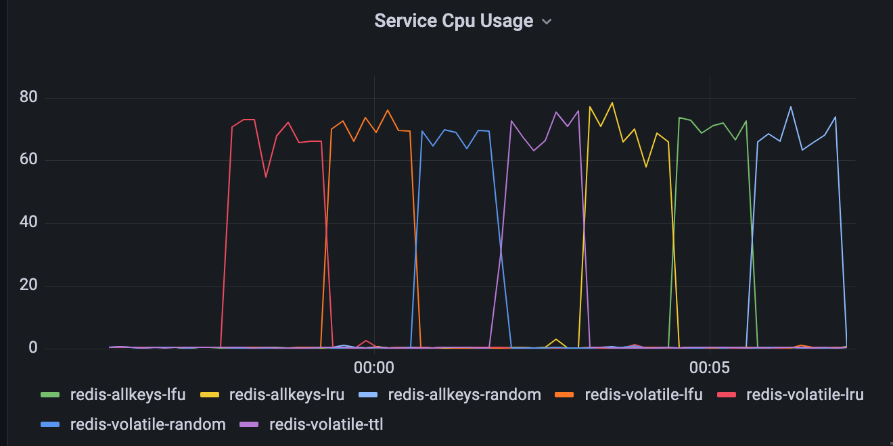

# Redis

## Assignment
- Build master-slave redis cluster
- Try all eviction strategies
- Write a wrapper for Redis Client that implement probabilistic cache clearing

## 1. Build master-slave redis cluster
```bash
docker-compose -f docker-compose.cluster.yml up
```
Go to [http://localhost:18081/](http://localhost:18081/) to observe the Redis cluster:



As we can see, it consists of Master node and Replica node. When we try to write in Replica, it fails with error:

```bash
[replica] > set a 1
"READONLY You can't write against a read only replica."
```

Though, writing into master node is allowed:
```bash
[master] > set a 1
"OK"
```

The data is replicated, so we can read it from both master and replica:
```bash
[master] > get a
"1"
[replica] > get a
"1"
```

## 2. Try all eviction strategies

Redis data eviction strategies:
- **volatile-lru** – Evict using approximated LRU (Least Recently Used) among the keys with an expire set.
- **allkeys-lru** – Evict any key using approximated LRU.
- **volatile-lfu** – Evict using approximated LFU (Least Frequently Used) among the keys with an expire set.
- **allkeys-lfu** – Evict any key using approximated LFU.
- **volatile-random** – Remove a random key among the ones with an expire set.
- **allkeys-random** – Remove a random key, any key.
- **volatile-ttl** – Remove the key with the nearest expire time (minor TTL)
- **noeviction** – Don't evict anything, just return an error on write operations.

There is no point in comparing noeviction strategy, since it raises an error when the memory is full. Therefore, we will reach all the rest.

Let's spin-up the infrastructure

```bash
docker-compose --compatibility up
docker-compose exec eviction-test ruby test.rb 1
```

There are usefull commands to track memory consumption or Redis instance statistics:

```bash
docker-compose exec redis-noeviction redis-cli info memory
docker-compose exec redis-allkeys-lru redis-cli info stats
```

Add a Docker CPU dashboard to Grafana:
```bash
from(bucket: "telegraf_bucket")
  |> range(start: v.timeRangeStart, stop: v.timeRangeStop)
  |> filter(fn: (r) => r["_measurement"] == "docker_container_cpu")
  |> filter(fn: (r) => r["_field"] == "usage_percent")
  |> filter(fn: (r) => r["com.docker.compose.service"] == "redis-allkeys-lfu" or r["com.docker.compose.service"] == "redis-allkeys-lru" or r["com.docker.compose.service"] == "redis-allkeys-random" or r["com.docker.compose.service"] == "redis-volatile-lfu" or r["com.docker.compose.service"] == "redis-volatile-lru" or r["com.docker.compose.service"] == "redis-volatile-random" or r["com.docker.compose.service"] == "redis-volatile-ttl")
  |> group(columns: ["com.docker.compose.service"])
  |> aggregateWindow(every: v.windowPeriod, fn: mean, createEmpty: false)
  |> yield(name: "mean")
```

And a memory usage dashboard
```bash
from(bucket: "telegraf_bucket")
  |> range(start: v.timeRangeStart, stop: v.timeRangeStop)
  |> filter(fn: (r) => r["_measurement"] == "redis")
  |> filter(fn: (r) => r["_field"] == "used_memory")
  |> aggregateWindow(every: v.windowPeriod, fn: mean, createEmpty: false)
  |> yield(name: "mean")
```

### 1 thread
Run benchmark script:
```bash
docker-compose exec eviction-test ruby test.rb 1

                        user     system      total        real
redis-volatile-lru     1.640791   2.545593   4.186384 (  8.090412)
redis-volatile-lfu     1.618322   2.678678   4.297000 (  8.202407)
redis-volatile-random  1.767907   2.641588   4.409495 (  8.684465)
redis-volatile-ttl     1.740942   2.445033   4.185975 (  8.432121)
redis-allkeys-lru      1.710226   2.319175   4.029401 (  8.477921)
redis-allkeys-lfu      1.773398   2.474949   4.248347 (  8.789480)
redis-allkeys-random   1.842899   2.794738   4.637637 (  8.759473)
```


During the test used memory was limited with 5mb:



### 4 threads
```bash
docker-compose exec eviction-test ruby test.rb 4

                        user     system      total        real
redis-volatile-lru     6.337984  10.353024  16.691008 ( 16.265668)
redis-volatile-lfu     6.094997  10.102740  16.197737 ( 16.429705)
redis-volatile-random  6.087602   9.959406  16.047008 ( 16.526932)
redis-volatile-ttl     5.868315   9.713267  15.581582 ( 16.082410)
redis-allkeys-lru      6.701989  10.795747  17.497736 ( 18.678240)
redis-allkeys-lfu      6.394001  10.611820  17.005821 ( 17.536853)
redis-allkeys-random   5.950890   9.662555  15.613445 ( 15.336220)
```



The CPU consumption is relatively similar.

### 10 threads
```bash
docker-compose exec eviction-test ruby test.rb 10

                        user     system      total        real
redis-volatile-lru   14.140947  21.999313  36.140260 ( 47.577457)
redis-volatile-lfu   14.447780  22.109829  36.557609 ( 48.222083)
redis-volatile-rando 14.631076  22.384788  37.015864 ( 48.668478)
redis-volatile-ttl   14.115545  22.041743  36.157288 ( 47.925549)
redis-allkeys-lru    14.407151  21.887251  36.294402 ( 47.548180)
redis-allkeys-lfu    14.497117  22.049567  36.546684 ( 47.873342)
redis-allkeys-random 14.515622  22.564251  37.079873 ( 48.410596)
```


### 20 threads
```bash
docker-compose exec eviction-test ruby test.rb 20

                        user     system      total        real
redis-volatile-lru   30.825143  46.731977  77.557120 ( 83.397387)
redis-volatile-lfu   29.530598  44.231981  73.762579 ( 79.292246)
redis-volatile-rando 29.016010  44.141052  73.157062 ( 78.992479)
redis-volatile-ttl   28.360365  43.804659  72.165024 ( 75.362316)
redis-allkeys-lru    29.012296  44.181192  73.193488 ( 77.044420)
redis-allkeys-lfu    28.773574  44.362451  73.136025 ( 75.397022)
redis-allkeys-random 28.447571  43.370878  71.818449 ( 76.224849)
```


## 3. Write a wrapper for Redis Client that implement probabilistic cache clearing
Probabilistic cache clearing is already implemented in [04#Load Testing with probabilistic cache flushing](../04_stress_testing#load-testing-with-probabilistic-cache-flushing)
