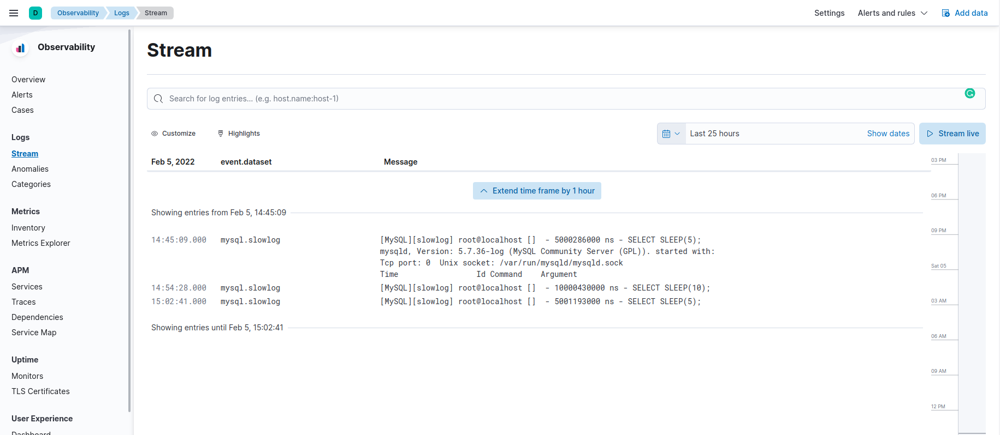

# How to install the application

1. Clone the repository `git clone https://qonand@bitbucket.org/qonand/homework13.git`
2. Run `docker-compose up -d --build` in project folder

# How to test 
1. Run `docker-compose exec mysql bash` in project folder
2. Login to mysql console with help `mysql -u root -p` command
3. Make a few query in mysql console, for example:
```
SELECT SLEEP(3);
SELECT SLEEP(5);
SELECT SLEEP(10);
```
4. Check logs

# Result example
