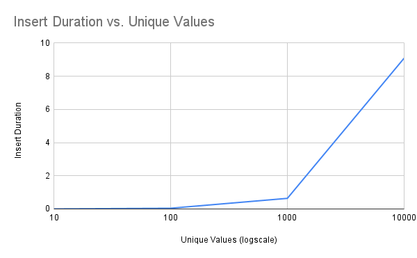
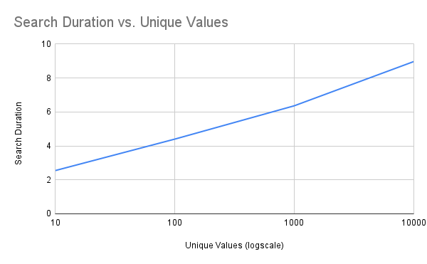

# 17. Data structures and Algorithms

## Assignment
Setup two docker containers:
1. Implement class for Balanced Binary Search Tree that can insert, find and delete elements.
2. Generate 100 random datasets and measure complexity
3. Implement Counting Sort algorithm
4. Figure out when Counting Sort doesn’t perform.

## Balanced Binary Search Tree

In the bst.py we've prepared the code to measure the algorithm complexity. It generates 20 experiments and takes the median execution time spent to insert all the nodes in the tree (10/100/1000/10000 elements) and to search through the tree (10 000 requests).

The tree size is defined as an argument from the command line.

```bash
docker-compose run --rm app python /app/bst.py 10
10 unique values. 20 experiments. Median Insert Duration:  0.002423 Median Search Duration:  2.545605

docker-compose run --rm app python /app/bst.py 100
100 unique values. 20 experiments. Median Insert Duration:  0.041452 Median Search Duration:  4.398957

docker-compose run --rm app python /app/bst.py 1000
1000 unique values. 20 experiments. Median Insert Duration:  0.63802 Median Search Duration:  6.363083

docker-compose run --rm app python /app/bst.py 1000
10000 unique values. 20 experiments. Median Insert Duration:  9.087176 Median Search Duration:  8.970172
```

[The results](https://docs.google.com/spreadsheets/d/e/2PACX-1vRRC2fmusP-yCG7MYsMZ8COn1CS4IUvILkU7GMFcak8Use4wZtYrETPtSCvgZMp5yQLkHHtosgksRGi/pubhtml) state that the insertion time grows linearly with the increase of tree size.



However, the search time increases logarithmically.



## Counting Sort algorithm

From the description of [Counting Sort](https://www.geeksforgeeks.org/counting-sort/) algorithm, it was evident that it performs poorly on arrays with the values of the big data range. Its time complexity is O(n+k), where n is the number of elements in the input array and k is the input range. All we need is to feed it a simple collection of two values [1, 10000000000000] to make it work forever.
Let's compare it with the default python sorting algorithm. ([Timsort](https://en.wikipedia.org/wiki/Timsort))

```bash
docker-compose run --rm app python /app/counting_sort.py

('Array: [2, 2, 0, 6, 1, 9, 9]', 'Median CountingSort Duration: ', 8.499999999999999e-05, 'Median Timsort Duration: ', 3.6e-05)
('Array length: 1000', 'Median CountingSort Duration: ', 0.000633, 'Median Timsort Duration: ', 0.00018800000000000002)
('Array length: 10000', 'Median CountingSort Duration: ', 0.005397000000000001, 'Median Timsort Duration: ', 0.0023229999999999995)
('Array: [1, 100000]', 'Median CountingSort Duration: ', 0.015222, 'Median Timsort Duration: ', 3.5e-05)
('Array: [1, 1000000]', 'Median CountingSort Duration: ', 0.159959, 'Median Timsort Duration: ', 3.6e-05)
('Array: [1, 10000000]', 'Median CountingSort Duration: ', 1.620734, 'Median Timsort Duration: ', 3.7e-05)
```
As we can see in the last three examples, the duration grows linearly when the min-max range increases. Therefore, this algorithm does not work for non-homogeneous data.

## References
- [Sorting algorithms visualization](https://www.toptal.com/developers/sorting-algorithms)
- [Self-balancing binary search tree](https://en.wikipedia.org/wiki/Self-balancing_binary_search_tree)
- [Implement a Binary Search Tree in Ruby](https://medium.com/analytics-vidhya/implement-a-binary-search-tree-in-ruby-c3fa9192410b)
- [Self-balancing Binary Search Trees](https://www.baeldung.com/cs/self-balancing-bts)
- [The results](https://docs.google.com/spreadsheets/d/e/2PACX-1vRRC2fmusP-yCG7MYsMZ8COn1CS4IUvILkU7GMFcak8Use4wZtYrETPtSCvgZMp5yQLkHHtosgksRGi/pubhtml)
